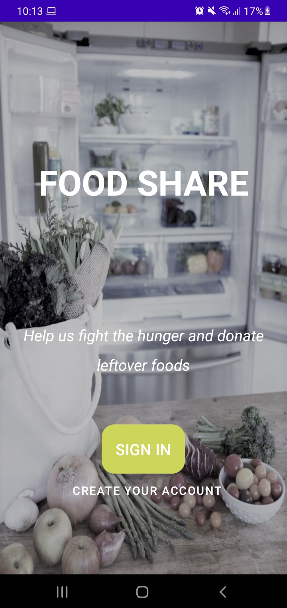
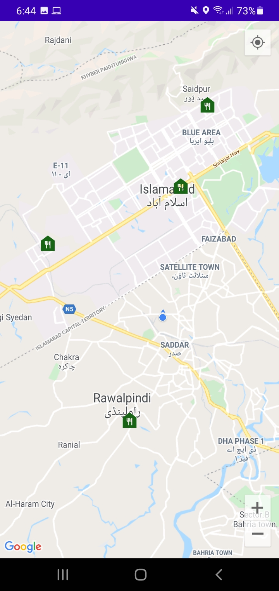
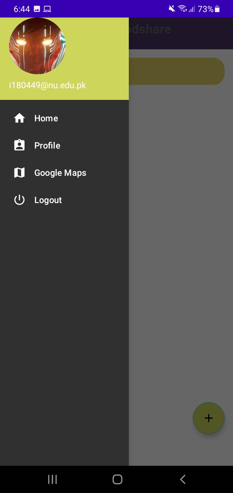
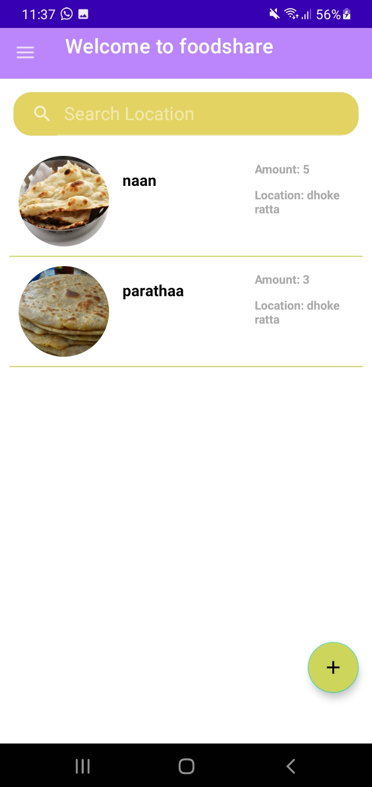

# share_food-Android-
   
Instructions:

    1. Create a firebase account and link it with the project via google-services.json.
    2. This project also uses a XAMPP PHP Server so the php files are provided in the PHP_Files folder.
    3. Install XAMPP, create a database and a table (screenshots are provided in the PHP_Files folder for guidance).
    4. Get your Google Maps API key from the google site and paste it in the Maps Activity.
    

  
